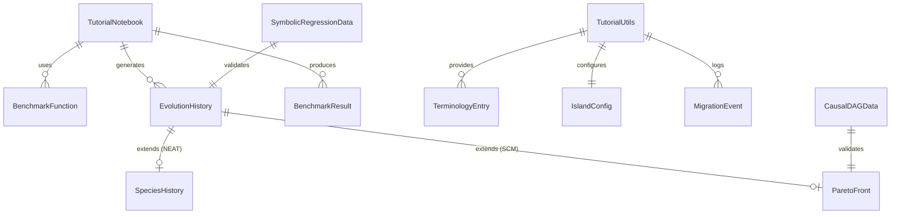

# Data Model: Tutorial Notebooks for Evolve Framework

**Phase**: 1 - Design  
**Date**: 2026-01-31  
**Status**: Complete

## Overview

This document defines the data structures and types used by the `tutorial_utils.py` module and referenced across all tutorial notebooks. The model focuses on synthetic data generation, visualization data flows, and terminology mapping.

## Core Entities

### 1. Synthetic Data Generators

#### BenchmarkFunction

Represents a continuous optimization benchmark for VectorGenome tutorials.

```python
@dataclass
class BenchmarkFunction:
    """Configuration for a benchmark optimization function."""
    name: str                          # Human-readable name (e.g., "Rastrigin")
    dimensions: int                    # Number of input dimensions
    bounds: tuple[float, float]        # Search space bounds (min, max)
    global_optimum: float              # Known optimal fitness value
    optimal_position: np.ndarray | None  # Position of global optimum (if unique)
    
    def evaluate(self, x: np.ndarray) -> float:
        """Evaluate fitness at position x."""
        ...
```

**Instances**: Sphere, Rastrigin, Rosenbrock, Ackley

#### SymbolicRegressionData

Synthetic data for SequenceGenome symbolic regression tutorials.

```python
@dataclass
class SymbolicRegressionData:
    """Dataset for symbolic regression experiments."""
    X_train: np.ndarray                # Training inputs (n_samples, n_features)
    y_train: np.ndarray                # Training targets (n_samples,)
    X_test: np.ndarray                 # Test inputs
    y_test: np.ndarray                 # Test targets
    true_expression: str               # Ground truth formula (e.g., "x^2 + 2*x + 1")
    noise_level: float                 # Applied noise std (0.0-1.0 scale)
    seed: int                          # Random seed used
```

**Generators**: `polynomial_data()`, `trigonometric_data()`, `composite_data()`

#### CausalDAGData

Synthetic causal data for SCMGenome tutorials.

```python
@dataclass
class CausalDAGData:
    """Dataset with known causal structure for discovery experiments."""
    observations: pd.DataFrame         # Observed data (n_samples, n_variables)
    adjacency_matrix: np.ndarray       # Ground truth DAG (n_vars, n_vars)
    variable_names: list[str]          # Column names
    hidden_variables: list[str]        # Variables removed from observations
    noise_level: float                 # Noise applied to mechanisms
    seed: int                          # Random seed used
    
    def edge_accuracy(self, predicted: np.ndarray) -> dict[str, float]:
        """Compute precision, recall, F1 for edge recovery."""
        ...
```

---

### 2. Visualization Data Structures

#### EvolutionHistory

Tracks metrics across generations for convergence plots.

```python
@dataclass
class EvolutionHistory:
    """Aggregated metrics from an evolutionary run."""
    generations: list[int]             # Generation indices [0, 1, 2, ...]
    best_fitness: list[float]          # Best fitness per generation
    mean_fitness: list[float]          # Population mean fitness
    worst_fitness: list[float]         # Worst fitness per generation
    std_fitness: list[float]           # Fitness standard deviation
    diversity: list[float]             # Population diversity metric
    
    @classmethod
    def from_callback_logs(cls, logs: list[dict]) -> "EvolutionHistory":
        """Construct from evolution callback logs."""
        ...
```

#### SpeciesHistory

Tracks species dynamics for NEAT speciation visualization.

```python
@dataclass
class SpeciesHistory:
    """Species population counts over generations."""
    generations: list[int]
    species_counts: dict[int, list[int]]  # {species_id: [count_gen0, count_gen1, ...]}
    species_births: dict[int, int]        # {species_id: birth_generation}
    species_extinctions: dict[int, int]   # {species_id: extinction_generation}
    
    def to_stacked_area_data(self) -> tuple[np.ndarray, list[str]]:
        """Convert to format for matplotlib stackplot."""
        ...
```

#### ParetoFront

Represents solutions on the Pareto frontier for multi-objective visualization.

```python
@dataclass
class ParetoFront:
    """Non-dominated solutions from multi-objective optimization."""
    objectives: np.ndarray             # (n_solutions, n_objectives) fitness values
    objective_names: list[str]         # ["data_fit", "sparsity", "simplicity"]
    solutions: list[Any]               # Corresponding genomes/phenotypes
    generation: int                    # Generation when front was captured
    
    def dominates(self, a_idx: int, b_idx: int) -> bool:
        """Check if solution a dominates solution b."""
        ...
    
    def crowding_distances(self) -> np.ndarray:
        """Compute crowding distance for each solution."""
        ...
```

---

### 3. Terminology & Glossary

#### TerminologyEntry

Maps EA terms to ML concepts with explanations.

```python
@dataclass
class TerminologyEntry:
    """Single term in the EA-to-ML glossary."""
    ea_term: str                       # Evolutionary algorithm term
    ml_analogy: str                    # Machine learning equivalent
    biology_origin: str                # Biological inspiration
    explanation: str                   # Detailed explanation for learners
    example: str | None                # Optional code/usage example
```

#### Glossary (Static Data)

| EA Term | ML Analogy | Biology Origin | Explanation |
|---------|-----------|----------------|-------------|
| Genome | Model weights | DNA | Complete parameter encoding |
| Phenotype | Model behavior | Organism | Decoded/evaluated form |
| Fitness | -Loss | Survival | Quality measure (higher = better) |
| Population | Ensemble | Species | Collection of candidate solutions |
| Generation | Epoch | Lifespan | One full selection/variation cycle |
| Selection | Batch sampling | Natural selection | Choosing parents by fitness |
| Crossover | Weight interpolation | Sexual reproduction | Combining parent information |
| Mutation | Gradient noise | Random mutation | Small random perturbations |
| Elitism | Best checkpoint | N/A | Preserving top performers |
| Diversity | Ensemble variance | Biodiversity | Population spread in solution space |

---

### 4. Island Model Structures

#### IslandConfig

Configuration for parallel island model execution.

```python
@dataclass
class IslandConfig:
    """Configuration for island model parallelism."""
    num_islands: int = 4               # Number of parallel populations
    population_per_island: int = 50    # Individuals per island
    migration_interval: int = 10       # Generations between migrations
    migration_rate: float = 0.1        # Fraction of population migrating
    topology: Literal["ring", "star", "fully_connected"] = "ring"
```

#### MigrationEvent

Records migration for logging and visualization.

```python
@dataclass
class MigrationEvent:
    """Record of a migration between islands."""
    generation: int
    source_island: int
    destination_island: int
    num_migrants: int
    migrant_fitness: list[float]
```

---

### 5. Benchmark Results

#### BenchmarkResult

Stores timing comparisons for CPU/GPU and single/island.

```python
@dataclass
class BenchmarkResult:
    """Timing results from a benchmark comparison."""
    configuration: str                 # e.g., "CPU-single", "GPU-island"
    total_time_seconds: float
    generations: int
    population_size: int
    final_best_fitness: float
    generations_per_second: float
    
    @property
    def speedup_vs(self, baseline: "BenchmarkResult") -> float:
        """Compute speedup factor relative to baseline."""
        return baseline.total_time_seconds / self.total_time_seconds
```

---

## Entity Relationships



---

## Validation Rules

1. **Seed Consistency**: All data generators must produce identical output given same seed
2. **Noise Bounds**: `noise_level` must be in [0.0, 1.0] range
3. **Dimension Matching**: `BenchmarkFunction.dimensions` must match genome length
4. **DAG Validity**: `CausalDAGData.adjacency_matrix` must be acyclic (no cycles)
5. **Pareto Validity**: All solutions in `ParetoFront` must be non-dominated
6. **History Length**: All lists in `EvolutionHistory` must have equal length
